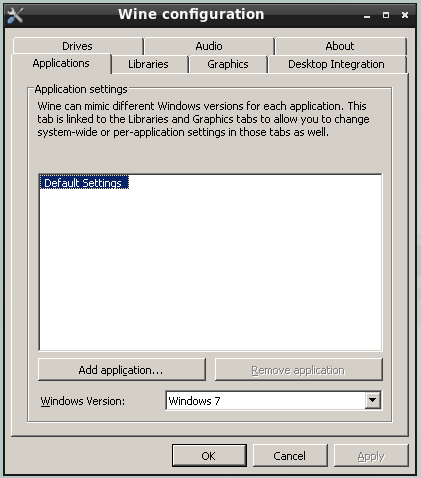
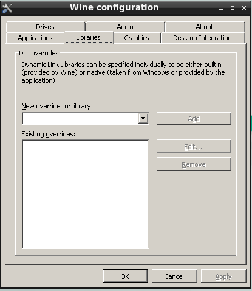
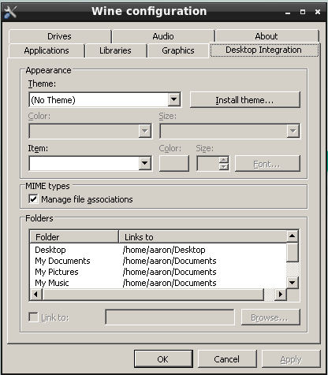
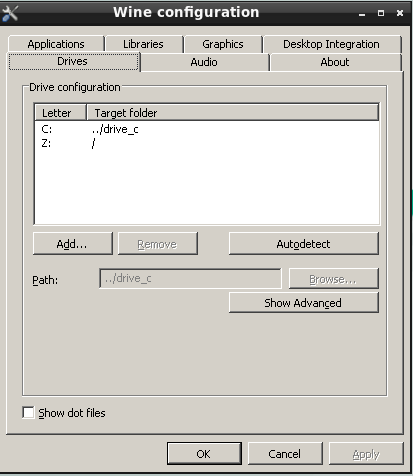
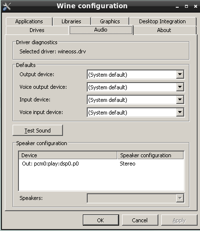

# 11.5.配置 WINE 安装

在了解了什么是 WINE 以及它如何在高层次上工作之后，在 FreeBSD 上有效使用它的下一步就是熟悉它的配置。下面几节将描述 WINE Prefixes 的关键概念，并说明如何用它来控制通过 WINE 运行的应用程序的行为。

## 11.5.1. WINE Prefixes

WINE Prefixes 是一个目录，通常位于 **$HOME/.wine** 的默认位置之下，尽管它可以位于其他地方。WINE Prefixes 是一组配置和支持文件，由 wine 用来配置和运行特定应用程序所需的 Windows® 环境。默认情况下，一个全新的WINE安装在用户首次启动时将创建以下结构。

- **.update-timestamp** ：包含文件 **/usr/share/wine/wine.inf** 的最后修改日期。它被 WINE 用来判断一个 WINE Prefixes 是否过时，并在需要时自动更新它。
- **dosdevices/** : 包含 Windows® 资源与主机FreeBSD系统上的资源的映射信息。例如，在新的WINE安装之后，这里应该至少包含两个条目，可以使用 Windows® 风格的驱动器字母来访问 FreeBSD 的文件系统。
  - **c:@** : 与下面描述的 **drive\_c** 的链接。
  - **z:@** : 到系统根目录的链接。
- **drive\_c/** : 模拟 Windows® 系统的主驱动器（即 **C：** ）。它包含一个目录结构和相关文件，与标准的 Windows® 系统一样。一个新的 WINE Prefixes 将包含 Windows® 10 目录，如 Users 和 Windows ，其中包含操作系统本身。此外，安装在 WINE Prefixes 中的应用程序将位于 Program Files 或 Program Files (x86) 中，这取决于其架构。
- **system.reg** ：这个注册表文件包含了 Windows® 安装的信息，在 WINE 的情况下，它是 **drive\_c** 中的环境。
- **user.reg** : 这个注册表文件包含了当前用户的个人配置，由各种软件或通过使用注册表编辑器来完成。
- **userdef.reg** : 这个注册表文件是新创建的用户的默认配置集。

## 11.5.2. 创建和使用 WINE Prefixes

虽然 WINE 会在用户的 **$HOME/.wine/** 中创建一个默认 WINE Prefixes ，但也可以设置多个 WINE Prefixes。这样做有几个原因：

- 最常见的原因是根据有关软件的兼容性需要，模拟不同版本的 Windows® 。
- 此外，经常会遇到一些在默认环境下不能正常工作的软件，需要进行特殊的配置。将这些软件隔离在自己的自定义 WINE Prefixes 中是很有用的，这样的改变不会影响其他应用程序。
- 同样，为了评估一个应用程序的兼容性，将默认或 " main " Prefixes复制到一个单独的 " testing " Prefixes 中，可以减少出错的可能性。

从终端创建一个 WINE Prefixes 需要使用以下命令：

```
% WINEPREFIX="/home/username/.win-new" winecfg
```

这将运行 winecfg 程序，该程序可用于配置 WINE Prefixes（在后面的章节中会有更多介绍）。但通过为 WINEPREFIX 环境变量提供一个目录路径值，如果一个 WINE Prefixes 还不存在，就会在该位置创建一个新的 WINE Prefixes：

向 wine 程序提供同样的变量，同样会导致所选程序以指定的 WINE Prefixes 运行：

```
% WINEPREFIX="/home/username/.win-new" wine program.exe
```

## 11.5.3. 用 winecfg 配置 WINE Prefixes

如上所述，WINE包括一个名为 winecfg 的工具，可以在图形用户界面中配置 WINE Prefixes 。它包含各种功能，在下面的章节中会详细介绍。当 winecfg 从一个 WINE Prefixes 中运行时，或者在 `WINEPREFIX` 变量中提供一个 WINE Prefixes 的位置时，它就可以对所选的 Prefixes 进行配置，如以下各节所述。

在 "应用程序 "选项卡上进行的选择将影响在 " _Libraries_ "和 " _Graphics_ "选项卡上的更改范围，这些更改将被限制在所选的应用程序中。更多细节请参见 WINE Wiki 中关于使用 Winecfg 的部分。

### 11.5.3.1. 应用程序



_Applications_ 包含了使程序与特定版本的 Windows® 相关联的控制。第一次启动时，应用程序设置部分将包含一个条目。默认设置。这相当于 WINE Prefixes 的所有默认配置，（正如禁用的删除应用程序按钮所暗示的）不能被删除。

但可以通过以下过程添加额外的应用程序：

1. 单击`Add application`按钮。
2. 使用提供的对话框选择所需的程序的可执行文件。
3. 选择要与所选程序一起使用的 Windows® 版本。

### 11.5.3.2. 库



WINE 提供了一组开源的库文件作为其发行的一部分，这些库文件提供了与 Windows® 对应的相同功能。然而，正如本章前面所提到的，WINE 项目一直在努力跟上这些库的新更新。因此，与 WINE 一起发行的版本可能缺少最新 Windows® 程序所期望的功能。

然而，winecfg 可以为内置的库指定重写，特别是在安装 FreeBSD 的同一台机器上有 Windows® 的版本。对于每一个要被覆盖的库，请执行以下操作：

1. 打开 New override for library 下拉菜单，选择要替换的库。
2. 点击 Add 按钮。
3. 新的覆盖将出现在 Existing overrides 列表中，注意括号中的native、builtin指定。
4. 点击选择该库。
5. 点击 `Edit`按钮。
6. 使用提供的对话框选择一个相应的库来代替内置库。

请确保选择一个真正与内置库对应的文件，否则可能会有意想不到的行为。

### 11.5.3.3. 图形


图形选项卡提供了一些选项，使通过 WINE 运行的程序的窗口能够在 FreeBSD 中顺利运行：

- 当窗口为全屏时自动捕捉鼠标。
- 允许 FreeBSD 的窗口管理器装饰窗口，例如通过 WINE 运行的程序的标题栏。
- 允许窗口管理器为通过 WINE 运行的程序控制窗口，例如对它们运行调整大小的功能。
- 创建一个模拟的虚拟桌面，所有 WINE 程序将在其中运行。如果选择了这个项目，虚拟桌面的大小可以用桌面大小输入框来指定。
- 为通过 WINE 运行的程序设置屏幕分辨率。

### 11.5.3.4. 桌面集成



这个标签允许配置以下项目：

- 通过 WINE 运行的程序要使用的主题和相关的视觉设置。
- WINE 子系统是否应该在内部管理 MIME 类型（用于确定哪个应用程序打开特定的文件类型）。
- FreeBSD 主机系统中的目录与 Windows® 环境中的有用文件夹的映射。要改变现有的关联，选择所需的项目并点击浏览，然后使用提供的对话框选择一个目录。

### 11.5.3.5. 驱动器



_Drives_ 选项卡允许将主机 FreeBSD 系统中的目录与 Windows® 环境中的驱动器字母联系起来。这个选项卡中的默认值应该看起来很熟悉，因为它们显示的是当前 WINE WINE Prefixes 中 **dosdevices/** 的内容。通过这个对话框所做的改变将反映在 **dosdevices** 中，在该目录中创建的正确格式的链接将显示在这个标签中。

要创建一个新的条目，例如 CD-ROM（挂载在 **/mnt/cdrom** ），采取以下步骤：

1. 点击 _Add_ 按钮。
2. 在提供的对话框中，选择一个空闲的盘符。
3. 点击 _OK_ 。
4. 在路径输入框中输入资源的路径，或者点击 _Browse_ 并使用提供的对话框来选择它。

默认情况下，WINE 会自动检测所链接的资源类型，但这可以被手动覆盖。关于高级选项的更多细节，请参见 WINE Wiki 中的章节。

### 11.5.3.6. 音频



这个选项卡包含了一些可配置的选项，用于将 Windows® 程序的声音路由到原生的 FreeBSD 声音系统，包括：

- 驱动程序选择
- 默认设备选择
- 声音测试

### 11.5.3.7. 关于


最后一个标签包含了关于 WINE 项目的信息，包括一个网站的链接。它还允许输入（完全可选的）用户信息，尽管这些信息不会像其他操作系统那样被发送到任何地方。
