# 11.6.WINE 图形管理用户界面

虽然 WINE 的基本安装包含一个 winecfg 的 GUI 配置工具，但它的主要目的只是：严格配置现有的 WINE Prefixes 。然而，还有一些更高级的应用程序，它们将协助应用程序的初始安装，以及优化它们的 WINE 环境。下面的章节包括了一些最流行的选择。

## 11.6.1. Winetricks

winetricks 是一个跨平台的、通用的 WINE 辅助程序。它不是由 WINE 项目本身开发的，而是由一群贡献者在 Github 上维护。它包含了一些自动的 "配方"，通过优化设置以及自动获取一些 DLL 库，使普通应用程序在 WINE 上运行。

### 11.6.1.1. 安装 winetricks

要在使用二进制包的 FreeBSD 上安装 winetricks，请使用以下命令（注意 winetricks 需要 i386-wine 或 i386-wine-devel 包，因此不会与其他依赖项一起自动安装）。

```
# pkg install i386-wine winetricks
```

要从源代码编译它，请在终端发出以下命令：

```
# cd /usr/ports/emulators/i386-wine
# make install
# cd /usr/ports/emulators/winetricks
# make install
```

如果需要手动安装，请参考 [Github](https://github.com/Winetricks/winetricks) 账户的说明：

### 11.6.1.2. 使用 winetricks

用以下命令运行 winetricks：

```
% winetricks
```

注意：这应该是在 32 位的 WINE Prefixes 下运行 winetricks。启动 winetricks 会显示一个有许多选择的窗口，如下所示:

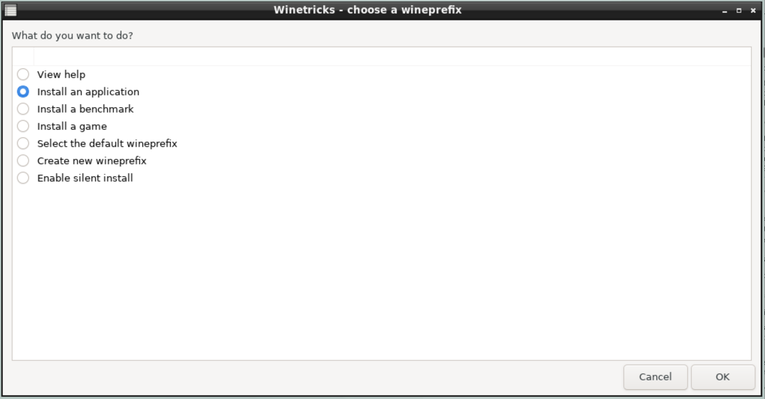

选择 " _Install an application_ "、" _Install a benchmark_ "或 " _Install a game_ "会显示一个支持选项的列表，比如下面的应用程序列表:

.png>)

选择一个或多个项目并点击 _OK_ 将开始它们的安装过程。最初，一些看似错误的信息可能会出现，但它们实际上是 winetricks 在配置 WINE 环境以解决应用程序的已知问题时发出的信息提示:

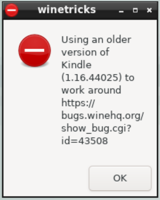

一旦这些被规避，应用程序的实际安装程序将被运行:


安装完成后，新的 Windows 应用程序应该可以从桌面环境的标准菜单中找到（如下图 LXQT 桌面环境的截图）:


为了删除该应用程序，再次运行 winetricks ，并选择 _Run an uninstaller_ :

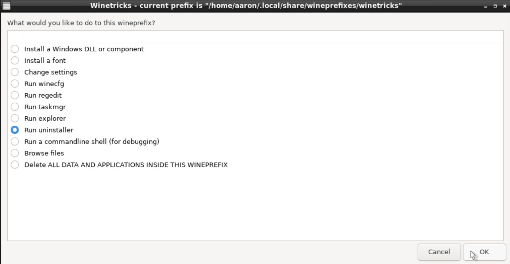

一个 Windows® 风格的对话框将出现，其中有一个已安装的程序和组件的列表。选择要删除的应用程序，然后点击修改/删除按钮:


这将运行应用程序的内置安装程序，它也应该有卸载的选项:

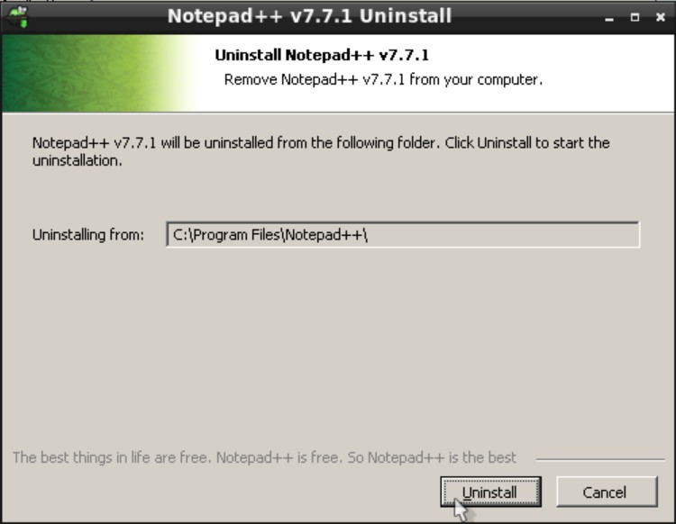

## 11.6.2. Homura

Homura 是一个类似于 winetricks 的应用程序，尽管它的灵感来自 Linux 的 Lutris 游戏系统。但是，虽然它专注于游戏，但也有一些非游戏的应用程序可以通过 Homura 安装。

### 11.6.2.1. 安装 Homura

要安装 Homura 的二进制包，发出以下命令：

```
# pkg install homura
```

Homura 在 FreeBSD Ports 系统中是可用的。然而，应该在游戏部分寻找它：

```
# cd /usr/ports/games/homura
# make install
```

### 11.6.2.2. 使用 Homura

Homura 的使用与 winetricks 的使用非常相似。第一次使用它时，从命令行（或桌面环境的运行程序）启动它：

```
% Homura
```

这应该会产生一个友好的欢迎信息。点击 " _OK_ "继续。

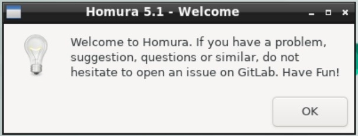

该程序还将提供在兼容环境的应用菜单中放置一个链接：

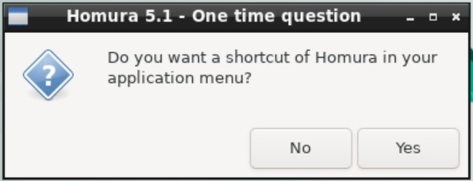

根据 FreeBSD 机器的设置，Homura 可能会显示一条敦促安装本地图形驱动程序的信息：


然后，应用程序的窗口应该出现，这相当于一个带有所有选项的 "主菜单"。许多项目与 winetricks 相同，尽管 Homura 提供了一些额外的、有用的选项，如打开其数据文件夹（ _Open Homura Folder_ ）或运行一个指定的程序（_Run a executable in prefix_）：

.png>)

要选择 Homura 支持的应用程序之一进行安装，选择安装，然后点击确定。这将显示一个 Homura 可以自动安装的应用程序的列表。选择一个，然后单击 " _OK_ "以开始该过程。

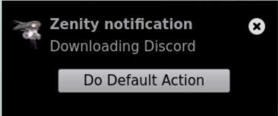

第一步，Homura 将下载选定的程序。在支持的桌面环境中可能会出现一个通知:

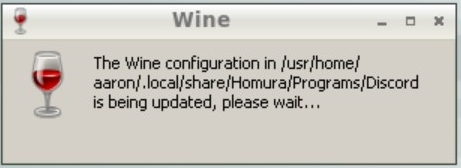

该程序还将为应用程序创建一个新的 WINE Prefixes。一个标准的 WINE 对话框将显示这个信息:

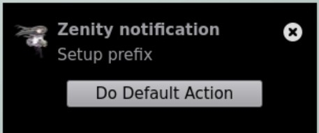

接下来，Homura 将为选定的程序安装先决条件。这可能涉及下载和提取相当数量的文件，其细节将显示在对话框中。


下载的软件包会根据需要自动打开并运行:

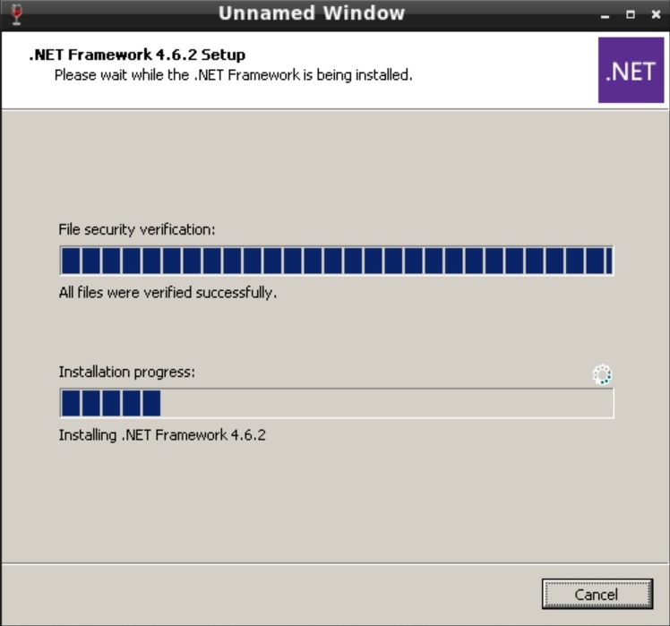

安装可能以一个简单的桌面通知或终端信息结束，这取决于 Homura 的启动方式。但无论哪种情况，Homura 都应该回到主屏幕。要确认安装成功，选择启动器，然后点击确定:


这将显示一个已安装的应用程序的列表:

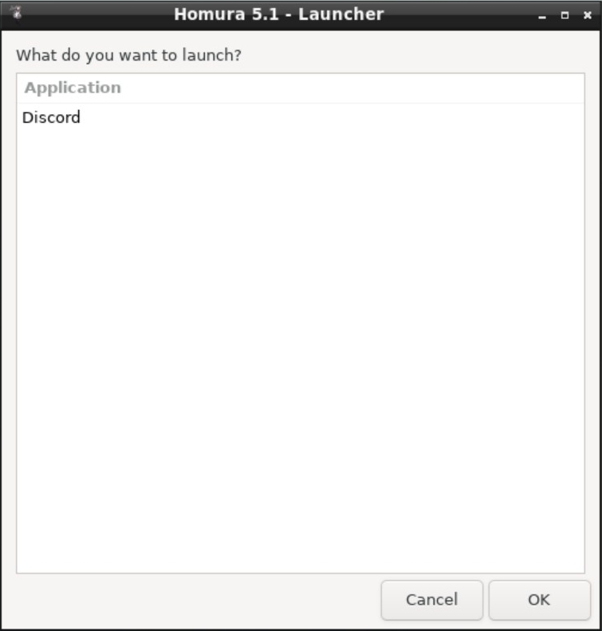

要运行新程序，从列表中选择它，然后点击 _OK_ 。要卸载该程序，从主屏幕上选择 " _Uninstallation_ "，它将显示一个类似的列表。选择要删除的程序，然后点击 _OK_ 。

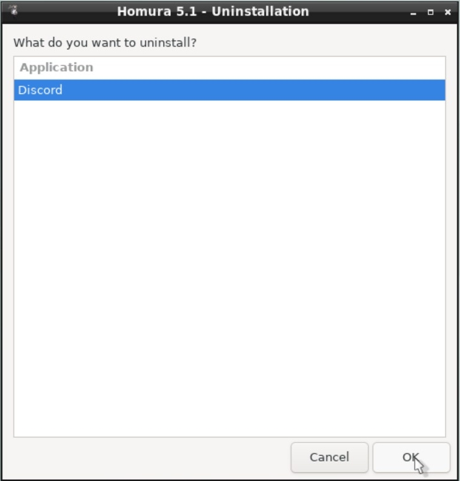

## 11.6.3. 运行多个管理图形用户界面

值得注意的是，上述解决方案并不是相互排斥的。完全可以接受，甚至是有利的，同时安装这两个软件，因为它们支持不同的程序集。

然而，明智的做法是，确保它们不访问任何相同的 WINE Prefixes。这些解决方案中的每一个都应用了变通方法，并根据现有 WINE 问题的已知变通方法对注册表进行了修改，以使特定的应用程序顺利运行。允许 winetricks 和 Homura 访问相同的 WINE Prefixes 可能会导致其中一些被覆盖，其结果是一些或所有的应用程序不能按预期运行。
