# 2.4. 开始安装

> **重点**
>
> 默认情况下，在出现以下信息之前，安装不会对磁盘进行任何修改。
>
> `Your changes will now be written to disk. If you have chosen to overwrite existing data, it will be PERMANENTLY ERASED. Are you sure you want to commit your changes?`
>
> 在此之前均可安全退出。如果担心有什么地方配置不正确，只要在这之前关闭计算机，系统的磁盘就不会有任何变化。

本节介绍了如何从安装介质启动系统，安装介质是按照《准备安装介质》中的说明准备的。当使用可启动的 U 盘时，在打开计算机之前插入 U 盘。当从 CD 或 DVD 启动时，请在第一时间打开计算机并插入媒体。如何配置系统以从插入的媒体启动，取决于架构。

## 2.4.1.在 i386™ 和 amd64 上启动

这些架构提供了一个 BIOS 菜单来选择启动设备。根据所使用的安装介质，选择 CD/DVD 或 USB 设备作为第一启动设备。大多数系统还提供了一个键，用于在启动过程中选择启动设备，而不需要进入 BIOS。一般来说，这个键是`F10`、`F11`、`F12`或`Escape`。

如果计算机加载的是现有的操作系统而不是 FreeBSD 的安装程序，除非：

1. 安装介质在启动过程中没有足够早地插入。让介质继续插入并尝试重新启动计算机。
2. BIOS 更改不正确或没有保存。仔细检查是否选择了正确的启动设备作为第一个启动设备。
3. 这个系统太老了，不支持从所选介质启动。在这种情况下，可以使用 Plop Boot Manager（http://www.plop.at/en/bootmanagers.html ）从选定的媒体启动系统。

## 2.4.2.在 PowerPC® 上启动

在大多数机器上，在启动过程中按住键盘上的`C`将从 CD 启动。否则，按住 `Command+Option+O+F`，或者在非苹果®键盘上按住 `Windows+Alt+O+F`。在`0>`提示下，输入

```
 boot cd:,\ppc\loader cd:0
```

## 2.4.3.FreeBSD 引导加载器菜单

一旦系统从安装介质启动，将显示一个类似于以下的菜单。


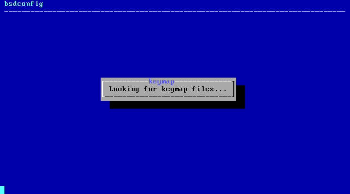


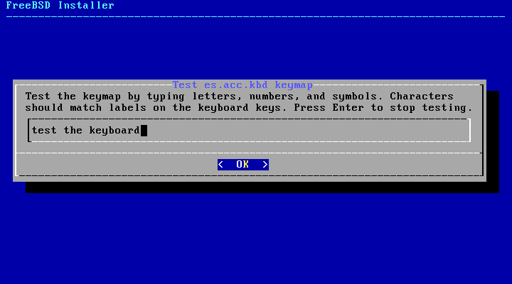


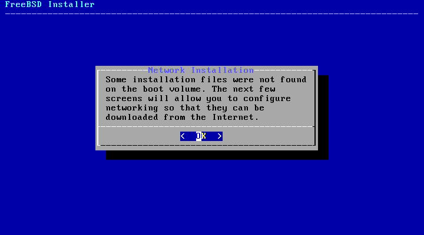

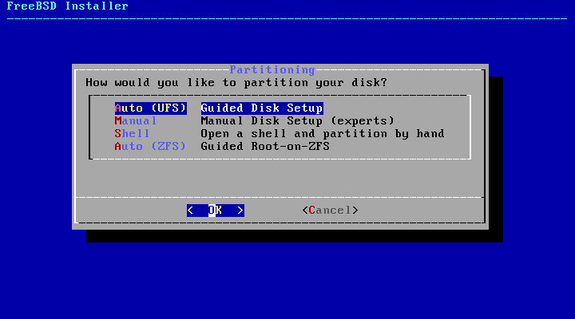

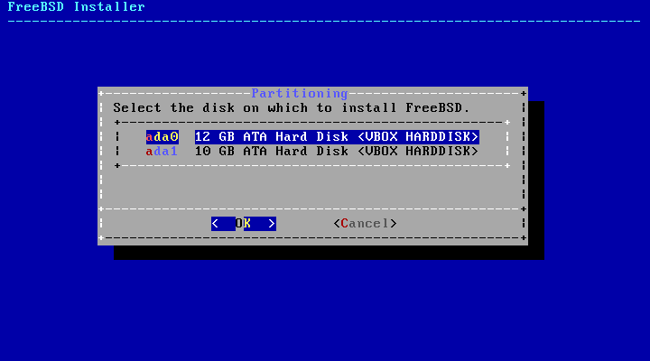

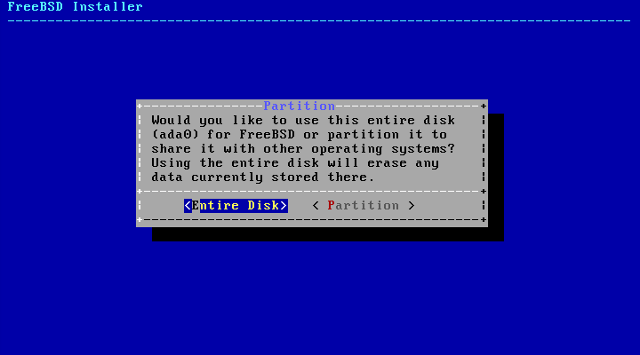


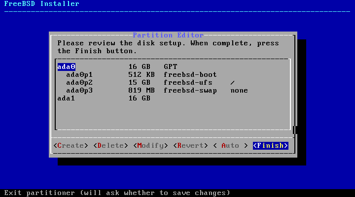

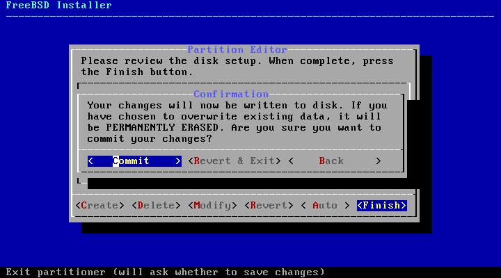


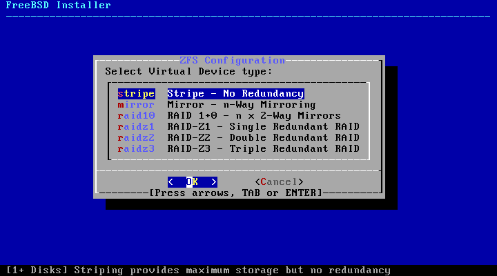

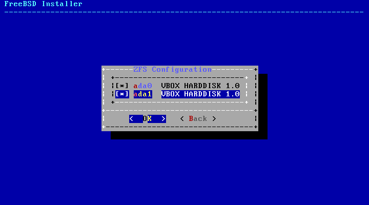


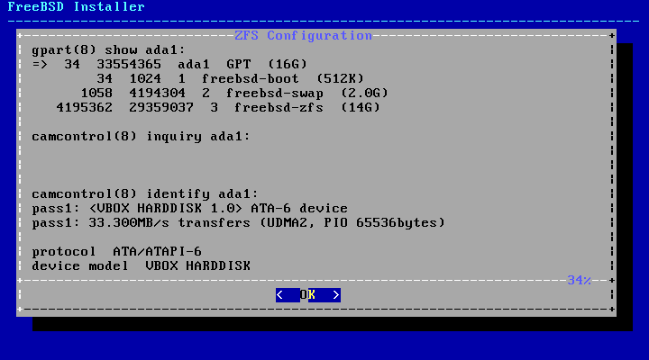

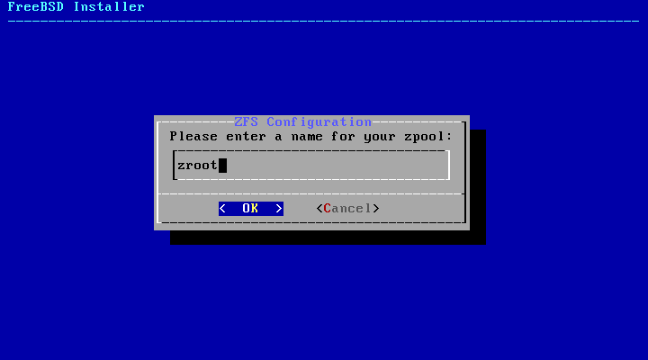


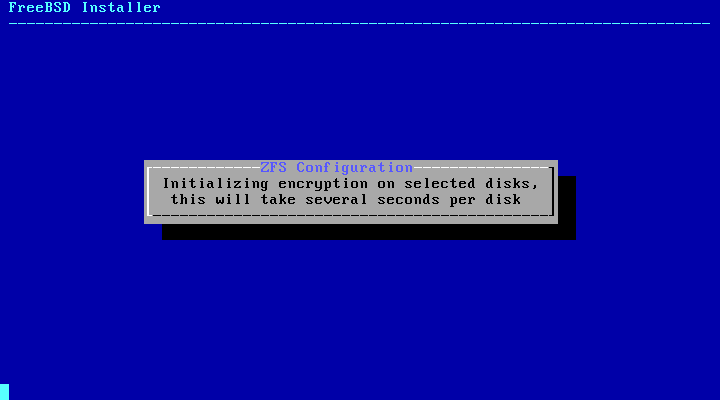


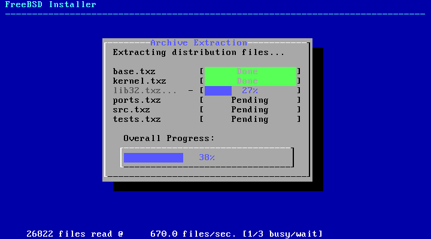


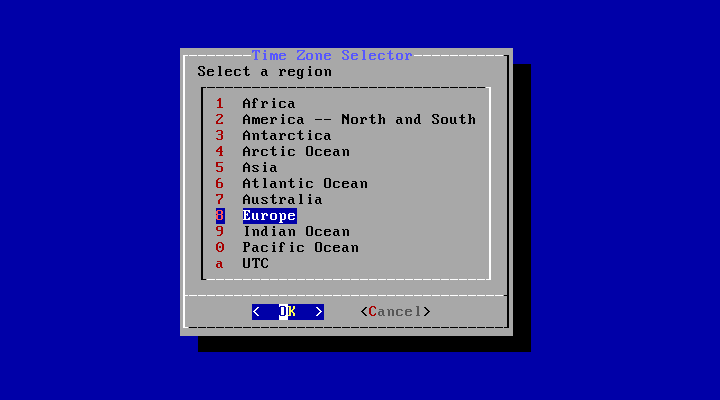


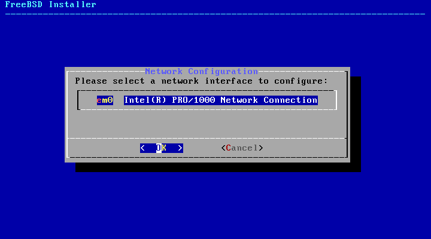


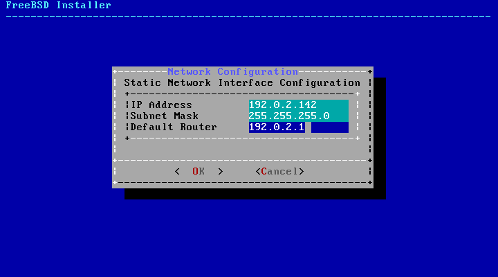


