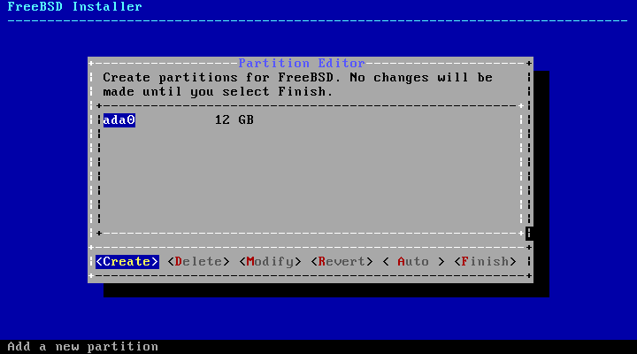
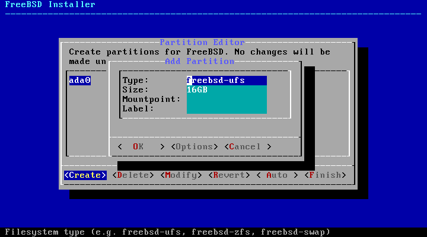
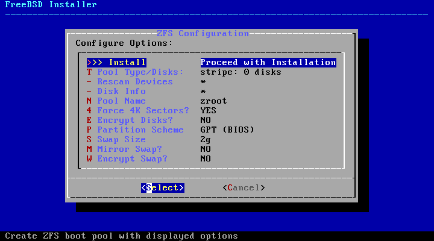
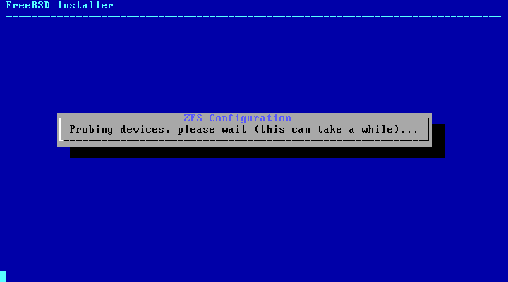
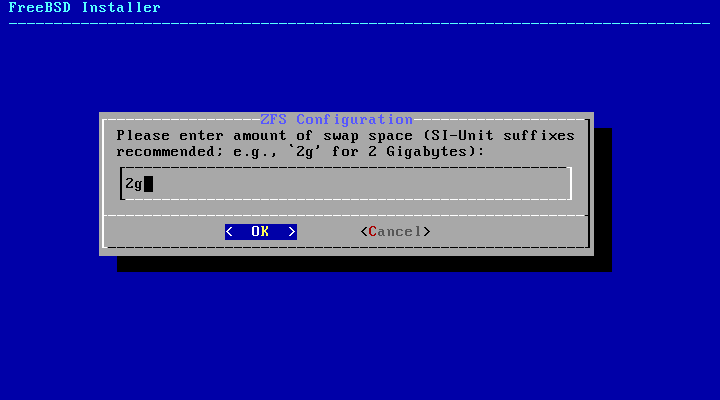
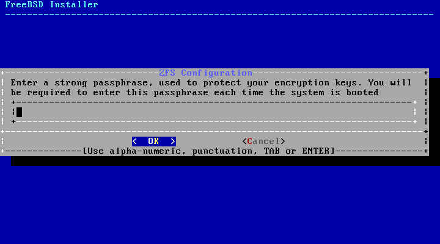

# 2.6. 分配磁盘空间

下一个菜单是用来确定分配磁盘空间的方法。

**Figure 10. Partitioning Choices**

bsdinstall 为用户提供了四种分配磁盘空间的方法：

- Auto (UFS) 分区使用 UFS 文件系统自动设置磁盘分区。

- Manual 分区允许高级用户通过菜单选项创建自定义分区。

- Shell 打开一个 shell 提示符，高级用户可以使用 gpart(8)、fdisk(8) 和 bsdlabel(8) 等命令行工具创建自定义分区。

- Auto (ZFS) 分区创建了一个 root-on-ZFS 系统，并为启动环境提供可选的 GELI 加密支持。

本节描述了在布置磁盘分区时需要考虑的问题。然后，它演示了如何使用不同的分区方法。

## 2.6.1.设计分区布局

在布局文件系统时，请记住，硬盘从外部轨道向内部传输数据的速度较快。因此，较小和较大的文件系统应该靠近硬盘的外部，而较大的分区，如`/usr`应该放在磁盘的内部。以类似的顺序创建分区是个好主意：`/`, `swap`, `/var`和`/usr`。

`/var`分区的大小反映了机器的用途。这个分区用来存放邮箱、日志文件和打印机线轴。信箱和日志文件可以增长到意想不到的大小，这取决于用户的数量和日志文件的保存时间。平均来说，大多数用户很少需要超过`/var`中约一千兆字节的自由磁盘空间。

>**注意：有时，在`/var/tmp`中需要大量的磁盘空间。当安装新软件时，打包工具会在`/var/tmp`下提取软件包的临时复制。如果`/var/tmp`下没有足够的磁盘空间，大型软件包，如 Firefox 或 LibreOffice 的安装可能会很麻烦。**

`/usr` 分区存放着许多支持系统的文件，包括 FreeBSD Ports Collection 和系统源代码。建议这个分区至少要有 2GB 的空间。

在选择分区大小的时候，要牢记空间的要求。一个分区的空间用完了，而另一个分区却几乎用不完，这可能是个麻烦事。

作为一个经验法则，交换分区应该是物理内存（RAM）的两倍。拥有最小内存的系统可能会因为有更多的交换空间而表现得更好。配置太小的交换空间会导致虚拟机页面扫描代码的效率低下，如果以后添加更多的内存，可能会产生问题。

在具有多个 SCSI 磁盘或在不同控制器上运行的多个 IDE 磁盘的大型系统上，建议在每个驱动器上配置交换空间，最多可配置四个驱动器。交换分区的大小应该大致相同。内核可以处理任意大小的分区，但是内部数据结构可以扩展到最大交换分区的 4 倍。保持交换分区接近相同的大小将允许内核以最佳的方式在不同的磁盘上剥离交换空间。大的交换空间是好的，即使交换空间用得不多。在被迫重启之前，可能更容易从失控的程序中恢复。

通过对系统进行适当的分区，在较小的写入量大的分区中引入的碎片将不会渗入主要读取的分区。让写入量大的分区更接近磁盘的边缘，将提高发生率最高的分区的 I/O 性能。虽然可能需要较大分区的 I/O 性能，但将它们移向磁盘边缘不会比将`/var`移向边缘带来明显的性能改善。

## 2.6.2.使用 UFS 进行向导式分区

当选择这种方法时，一个菜单将显示可用的磁盘。如果连接了多个磁盘，请选择要安装 FreeBSD 的那个磁盘。

**Figure 11. Selecting from Multiple Disks**

一旦选择了磁盘，下一个菜单就会提示安装到整个磁盘或利用可用空间创建一个分区。如果选择 "Entire Disk"，将自动创建一个充满整个磁盘的一般分区布局。选择 "Partition"则从磁盘上未使用的空间创建一个分区布局。

**Figure 12. Selecting Entire Disk or Partition**

在选择了 "Entire Disk"之后，bsdinstall 会显示一个对话框，表明磁盘所有内容将被删除。

**Figure 13. Confirmation**

下一个菜单显示了一个带有分区方案类型的列表。GPT 通常是 amd64 计算机最合适的选择。与 GPT 不兼容的老式计算机应该使用 MBR。其他分区方案一般用于不常见的或较老的计算机。更多信息可在分区方案中找到。

**Figure 14. Select Partition Scheme**

在创建了分区布局之后，请审查它以确保它符合安装的需要。选择`Revert`可以将分区重置为原来的值，按`Auto`可以重新创建自动的 FreeBSD 分区。分区也可以手动创建、修改或删除。当分区正确时，选择`Finish`来继续安装。

**Figure 15. Review Created Partitions**

一旦磁盘被配置好，下一个菜单提供了在选定的驱动器被格式化之前进行修改的最后机会。如果需要进行修改，请选择`Back`，返回到主分区菜单。`Revert & Exit`退出安装程序，不对驱动器做任何改变。选择 "Commit"，开始安装过程。

**Figure 16. Final Confirmation**

要继续安装过程，请进入 "获取分发文件"。

## 2.6.3.手动分区

手动式分区将直接使用分区编辑器进行操作。

**Figure 17. Manually Create Partitions**

突出显示安装驱动器（本例中为 ada0），并选择 "Create"以显示可用分区方案的菜单。

**Figure 18. Manually Create Partitions**

GPT 通常是 amd64 电脑的最合适选择。与 GPT 不兼容的老式计算机应该使用 MBR。其他分区方案一般用于不常见的或较老的计算机。

表格1.分区计划

|缩写|描述|
|:---:|:---:|
|APM|苹果分区表，PowerPC® 使用|
|BSD|不带 MBR 的 BSD Label， 有时也称作危险专用模式，因为非 BSD 磁盘工具可能无法识别它|
|GPT|GUID 分区表 (<http://en.wikipedia.org/wiki/GUID_Partition_Table>)|
|MBR|主引导记录 (<http://en.wikipedia.org/wiki/Master_boot_record>)|

选择并创建了分区方案后，再次选择`Create`来创建分区。`Tab`键用于在各领域之间移动光标。

**Figure 19. Manually Create Partitions**

一个标准的 FreeBSD GPT 安装至少要使用三个分区：

- freebsd-boot - 存放 FreeBSD 的启动代码。

- freebsd-ufs - 一个 FreeBSD UFS 文件系统。

- freebsd-zfs - 一个 FreeBSD ZFS 文件系统。关于 ZFS 的更多信息可以在 Z 文件系统（ZFS）中找到。

- freebsd-swap - FreeBSD 交换空间。

关于可用的 GPT 分区类型的描述，请参考 gpart(8)。

可以创建多个文件系统分区，有些人喜欢采用传统的布局，为 `/`、`/var`、`/tmp` 和 `/usr` 分开分区。请看创建传统分割文件系统分区的例子。

大小可以用常见的缩写来输入。`K`代表千字节，`M`代表兆字节，`G`代表千兆字节。

>**提示：正确的扇区对齐才能提供最好的性能，使分区大小为 4K 字节的偶数倍有助于确保在具有 512 字节或 4K 字节扇区的驱动器上对齐。一般来说，使用 1M 或 1G 的偶数倍的分区大小是确保每个分区从 4K 的偶数倍开始的最简单方法。有一个例外：由于目前启动代码的限制，freebsd-boot 分区不应大于 512K。**

如果该分区将包含一个文件系统，则需要一个挂载点(Mountpoint)。如果只创建一个 UFS 分区，挂载点应该是`/`。

标签（Label）是一个分区的名称，人们将通过它来了解该分区。如果驱动器被连接到不同的控制器或端口，驱动器的名称或编号可以改变，但分区的标签不会改变。在`/etc/fstab`等文件中参考标签而不是驱动器名称和分区号，可以使系统对硬件变化有更大的兼容性。GPT 标签在连接磁盘时出现在`/dev/gpt/`。其他分区方案有不同的标签功能，它们的标签出现在`/dev/`的不同目录中。

>**提示：在每个分区上使用一个独特的标签，以避免相同的标签产生冲突。可以将计算机名称、用途或位置中的几个字母添加到标签中。例如，在名为`lab`的计算机上使用`labroot`或`rootfslab`作为 UFS 根分区。**

>**例子 1.创建传统的分离式文件系统分区**
>
>对于传统的分区布局，即`/`、`/var`、`/tmp`和`/usr`目录在各自的分区上是独立的文件系统，创建一个 GPT 分区方案，然后按图所示创建分区。所示的分区大小是 20G 目标磁盘的典型情况。如果目标磁盘上有更多的空间，更大的交换分区或`/var`分区可能是有用的。这里显示的标签以`ex`为前缀，表示 "示例"，但读者应该使用其他独特的标签值，如上所述。
>
>默认情况下，FreeBSD 的 gptboot 希望第一个 UFS 分区是`/`分区。
>|分区类型|大小|挂载点|标签|
>|:---:|:---:|:---:|:---:|
>|freebsd-boot|512K|||
>|freebsd-ufs|2G|/|exrootfs|
>|freebsd-swap|4G||exswap|
>|freebsd-ufs|2G|/var|exvarfs|
>|freebsd-ufs|1G|/tmp|extmpfs|
>|freebsd-ufs|接受默认值(使用磁盘的剩余部分)|/usr|exusrfs|

自定义分区创建完毕后，选择`Finish`继续安装，并进入 "获取分发文件"。

## 2.6.4.使用 Root-on-ZFS 进行向导式分区

这种分区模式只适用于整个磁盘，并且会擦除整个磁盘的内容。ZFS 的主配置菜单提供了许多选项来控制池的创建。

**Figure 20. ZFS Partitioning Menu**

下面是这个菜单中可以使用的选项的摘要介绍。

- Install  - 使用选定的选项继续安装。

- Pool Type/Disks - 允许配置池类型和将构成池的磁盘。自动 ZFS 安装程序目前只支持创建一个顶层的 vdev，除了在 stripe 模式下。要创建更复杂的池，请使用 Shell 模式分区中的说明来创建池。

- Rescan Devices - 重新填充可用磁盘的列表。

- Disk Info - 磁盘信息菜单可以用来检查每个磁盘，包括它的分区表和其他各种信息，如设备型号和序列号（如果有）。

- Pool Name - 建立磁盘池的名称。默认名称是`zroot`。

- Force 4K Sectors? - 强制使用 4K 扇区。默认情况下，安装程序会自动创建与 4K 边界对齐的分区并强制 ZFS 使用 4K 扇区。这在 512 字节扇区的磁盘上也是安全的，而且还有一个额外的好处，那就是确保在 512 字节磁盘上创建的池子将来可以添加 4K 扇区的磁盘，作为额外的存储空间或替换故障磁盘。按回车键，选择是否激活它。

- Encrypt Disks? - 加密磁盘允许用户使用 GELI 对磁盘进行加密。更多关于磁盘加密的信息可以在 "Disk Encryption with geli "中找到。按回车键，选择是否激活它。

- Partition Scheme - 允许选择分区方案。GPT 是大多数情况下的推荐选项。按回车键在不同的选项中进行选择。

- Swap Size - 建立交换空间的数量。

- Mirror Swap?  - 允许用户在磁盘之间做镜像交换。请注意，启用镜像交换将破坏崩溃转储。按回车键来激活或不激活。

- Encrypt Swap?  - 允许用户对交换盘进行加密。每次系统启动时，用一个临时密钥加密交换，并在重启时丢弃。按回车键可以选择是否激活它。在 "Encrypting Swap "中有更多关于交换加密的信息。

选择`T`来配置`Pool Type`和构成池的磁盘。

**Figure 21. ZFS Pool Type**

下面是在这个菜单中可以选择的`Pool Type`的摘要。

- stripe - 条带化提供所有连接设备的最大存储量，但没有冗余。如果只有一个磁盘发生故障，池上的数据将不可逆转地丢失。

- mirror - 镜像在每个磁盘上存储所有数据的一个完整副本。镜像提供了良好的读取性能，因为数据是从所有磁盘上平行读取的。写入性能较慢，因为数据必须写到池中的所有磁盘上。允许除一个磁盘外的所有磁盘发生故障。这个选项至少需要两个磁盘。

- raid10 - 带状镜像。提供最好的性能，但存储量最少。这个选项至少需要偶数个磁盘，至少需要四个磁盘。

- raidz1 - 单一冗余 RAID。允许一个磁盘同时发生故障。该选项至少需要 3 个磁盘。

- raidz2 - 双重冗余 RAID。允许两个磁盘同时发生故障。该选项至少需要 4 个磁盘。

- raidz3 - 三重冗余 RAID。允许三个磁盘同时发生故障。该选项至少需要 5 个磁盘。

一旦选择了`Pool Type`，就会显示可用的磁盘列表，并提示用户选择一个或多个磁盘来组成池。然后，配置会被验证，以确保有足够的磁盘被选中。如果没有，选择`<Change Selection>`回到磁盘列表，或者`<Back>`改变池子类型。

**Figure 22. Disk Selection**

**Figure 23. Invalid Selection**

如果列表中缺少一个或多个磁盘，或者磁盘是在安装程序启动后连接的，请选择——`Rescan Devices`设备来重新填充可用磁盘的列表。

**Figure 24. Rescan Devices**

为了避免意外地擦除错误的磁盘， `Disk Info`菜单可以用来检查每个磁盘，包括其分区表和其他各种信息，如设备型号和序列号（如果有的话）。

**Figure 25. Analyzing a Disk**

选择`N`来配置`Pool Name`。输入所需的名称，然后选择`<OK>`建立它，或`<Cancel>`返回主菜单并保留默认名称。

**Figure 26. Pool Name**

选择`S`来设置交换量。输入所需的交换量，然后选择`<OK>`建立，或选择`<Cancel>`返回主菜单，让其使用默认量。
  

**Figure 27. Swap Amount**

一旦所有的选项都被设置为所需的值，选择菜单顶部的`>>> Install`。然后安装程序提供了一个最后的机会，在所选驱动器的内容被销毁以创建 ZFS 池之前，可以取消。

**Figure 28. Last Chance**

如果启用了 GELI 磁盘加密，安装程序将提示两次用于加密磁盘的口令。而后开始初始化加密。

**Figure 29. Disk Encryption Password**

**Figure 30. Initializing Encryption**

然后安装会正常进行。要继续安装，请进入 "获取分发文件"。

## 2.6.5.SHELL 模式分区

在创建高级安装时，`bsdinstall`的分区菜单可能无法提供所需的灵活性水平。高级用户可以从分区菜单中选择 Shell 选项，以便手动对驱动器进行分区，创建文件系统，填充 `/tmp/bsdinstall_etc/fstab`，并在 `/mnt` 下加载文件系统。完成后，键入`exit`，返回`bsdinstall`，继续安装。
