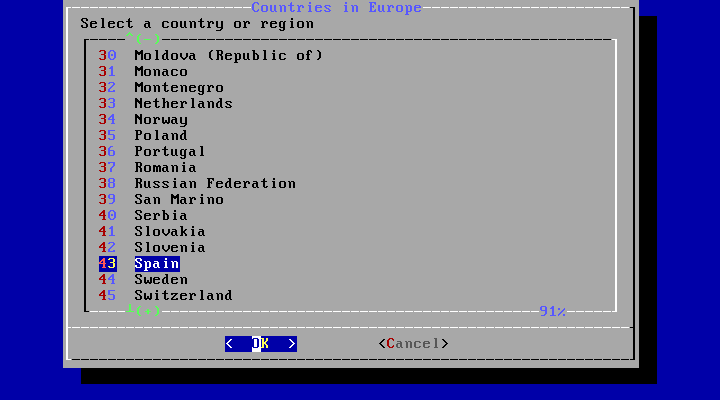
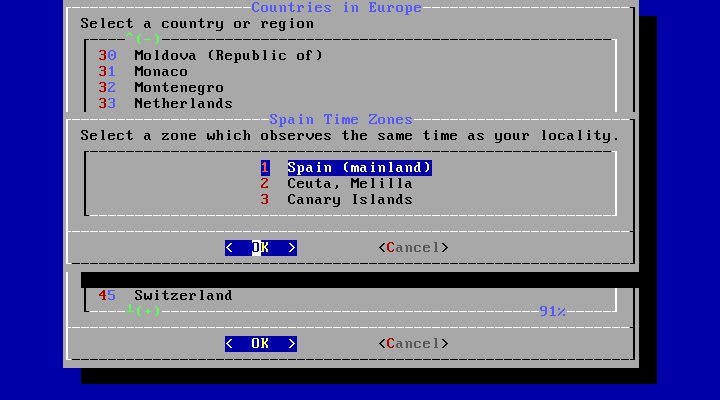
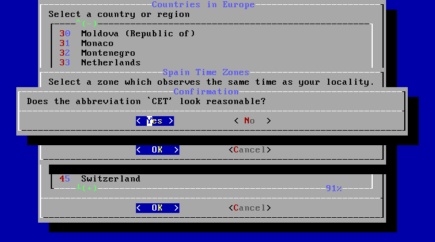
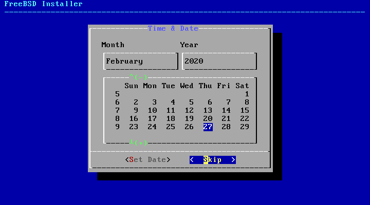
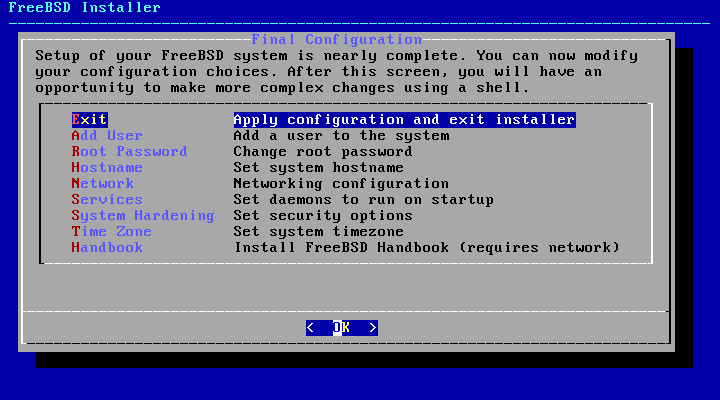

# 2.8.账户、时区、服务和安全

## 2.8.1.设置`root`密码

首先，必须设置`root`密码。在输入密码时，正在输入的字符不会显示在屏幕上。输入密码后，必须再次输入。这有助于防止输入错误。


**Figure 34. Setting the root Password**

## 2.8.2.设置时区

接下来的一系列菜单用于通过选择地理区域、国家和时区来确定正确的当地时间。设置时区可以使系统自动纠正地区时间变化，如夏令时，并正确执行其他与时区有关的功能。

这里显示的例子是针对位于欧洲西班牙大陆时区的机器。根据地理位置的不同，选择也会有所不同。


**Figure 35. Select a Region**

使用方向键选择适当的区域，然后按回车键。



**Figure 36. Select a Country**

用方向键选择适当的国家，然后按回车键。



**Figure 37. Select a Time Zone**

使用箭头键并按下回车键，选择适当的时区。



**Figure 38. Confirm Time Zone**

确认时区的简写是正确的。



**Figure 39. Select Date**

使用方向键选择适当的日期，然后按`Set Date`。否则，可以通过按跳过来`Skip`日期的选择。


**Figure 40. Select Time**

使用方向键选择适当的时间，然后按`Set Time`。否则，可以通过按跳过来` Skip`时间的选择。

## 2.8.3.开启服务

下一个菜单用于配置在系统启动时哪些系统服务将被启动。所有这些服务都是可选的。只启动系统运行所需的服务。


**Figure 41. Selecting Additional Services to Enable**

下面是在这个菜单中可以启用的服务的摘要。

- local_unbound - 启用 DNS 本地非绑定。有必要记住，这是基础系统的 unbound，只作为本地缓存转发解析器使用。如果目标是为整个网络建立一个解析器，请安装`dns/unbound`。

- sshd - 安全 shell（SSH）守护程序用于通过加密连接远程访问系统。只有在系统应该可用于远程登录的情况下才启用这个服务。

- moused - 如果要从命令行系统控制台使用鼠标，则启用该服务。

- ntpdate - 启用启动时的自动时钟同步功能。这个程序的功能现在在 ntpd(8) 守护进程中可用。在一段适当的哀悼期之后， ntpdate(8) 工具将退役。

- ntpd - 用于自动时钟同步的网络时间协议 (NTP) 守护进程。如果网络上有一个 Windows®、Kerberos 或 LDAP 服务器，请启用这个服务。

- powerd - 用于电源控制和节约能源的系统电源控制工具。

- dumpdev - 启用崩溃转储在调试系统问题时很有用，所以鼓励用户启用崩溃转储。

## 2.8.4.启用强化安全选项

下一个菜单是用来配置哪些安全选项将被启用。所有这些选项都是可选的。但我们鼓励开启它们。


**Figure 42. Selecting Hardening Security Options**

下面是这个菜单中可以启用的选项的摘要。

- hide_uids - 隐藏以其他用户身份运行的进程，防止非特权用户看到其他用户正在执行的进程（UID），防止信息泄露。

- hide_gids - 隐藏以其他组的名义运行的进程，以防止非特权用户看到其他组正在执行的进程（GID），防止信息泄露。

- hide_jail - 隐藏在 Jail 中运行的进程，防止非特权用户看到 Jail 中运行的进程。

- read_msgbuf - 禁止非特权用户使用 dmesg(8) 查看内核日志缓冲区的信息，以防止读取内核信息缓冲区。

- proc_debug - 禁用非特权用户的进程调试设施，禁用各种非特权的进程间调试服务，包括一些 procfs 功能、trace() 和 ktrace()。请注意，这也会阻止调试工具，例如 lldb(1)、truss(1)、procstat(1)，以及某些脚本语言（如 PHP）中的内置调试设施对非特权用户的作用。

- random_pid - 随机化新创建进程的 PID。

- clear_tmp - 在系统启动时清理/tmp。

- disable_syslogd - 禁止打开 syslogd 网络套接字。在默认情况下，FreeBSD 以安全的方式运行 syslogd，并使用`-s`。这可以防止守护进程在 514 端口监听传入的 UDP 请求。启用该选项后，syslogd 将以标志`-ss`运行，它可以防止 syslogd 打开任何端口。要获得更多信息，请参考 syslogd(8)。

- disable_sendmail - 禁用 sendmail 邮件传输代理。

- secure_console - 当这个选项被启用时，在进入单用户模式时，提示要求输入根密码。

- disable_ddtrace - DTrace 可以在实际影响运行中的内核的模式下运行。除非明确启用，否则不得使用破坏性的操作。要在使用 DTrace 时启用该选项，请使用 -w。要获得更多信息，请查阅 dtrace(1)。

## 2.8.5.添加用户

下一个菜单提示至少要创建一个用户账户。建议使用一个用户账户而不是以 root 身份登录系统。当以 root 身份登录时，对可以做的事情基本上没有限制或保护。以普通用户身份登录更安全、更有保障。

选择`YES`来添加新用户。


**Figure 43. Add User Accounts**

按照提示，输入所要求的用户账户信息。输入用户信息中显示的例子创建了一个`asample`用户账户。


**Figure 44. Enter User Information**
以下是需要输入的信息的摘要。

- Username - 用户登录时要输入的名字。一个常见的惯例是使用名字的第一个字母与姓氏相结合，只要每个用户名对系统来说是唯一的。用户名是区分大小写的，不应包含任何空格。

-Full name - 用户的全名。这可以包含空格，作为用户账户的描述。

- Uid - 用户 ID。通常情况下，这部分留空，所以系统会分配一个值。

- Login group - 用户的组别。典型的情况是留空，以接受默认值。

- Invite user into other groups? - 额外的组，用户将被添加为成员。如果用户需要管理权限，在这里输入轮子。

- Login class  - 通常留空以接受默认值。

- Shell - 键入一个列出的值来设置用户的交互式 shell。关于 shell 的更多信息，请参考 "shell"。

- Home directory - 用户的主目录。默认值通常是正确的。

- Home directory permissions - 用户的主目录的权限。默认值通常是正确的。

- Use password-based authentication?- 通常是的，这样用户在登录时就会被提示输入他们的密码。

- Use an empty password? - 通常不使用，因为空白的密码是不安全的。

- Use a random password? - 通常不是，这样用户可以在下一个提示中设置自己的密码。

- Enter password  - 这个用户的密码。输入的字符不会显示在屏幕上。

- Enter password again - 必须再次输入密码进行验证。

- Lock out the account after creation?- 通常是没有，这样用户就可以登录。

在输入所有内容后，会显示一个摘要供审查。如果犯了一个错误，输入`no`，再试一次。如果一切正确，输入`yes`来创建新用户。


**Figure 45. Exit User and Group Management**

如果有更多的用户需要添加，请在` Add another user?`问题上回答是。输入`no`可完成添加用户步骤并继续安装。

关于添加用户和用户管理的更多信息，请参阅 "用户和基本账户管理"。

## 2.8.6.最终配置

在所有东西都被安装和配置好之后，提供了一个修改设置的最后机会。



**Figure 46. Final Configuration**

在完成安装之前，使用此菜单进行任何修改或做任何额外的配置。

- Add User - 在添加用户章节中描述。

- Root Password  - 在设置 root 密码章节中描述。

- Hostname - 在设置主机名章节中描述。

- Network  - 在配置网络接口章节中描述。

- Services - 在启用服务章节中描述。

- System Hardening - 在启用加固安全选项中描述。

- Time Zone  - 在设置时区章节中进行了描述。

- Handbook - 下载并安装 FreeBSD 手册。

在任何最终配置完成后，选择`Exit`。


**Figure 47. Manual Configuration**

bsdinstall 会提示在重启到新系统之前是否有任何其他配置需要完成。选择 "Yes"退出到新系统的 shell，或者选择 "No"进入安装的最后一步。


**Figure 48. Complete the Installation**

如果需要进一步的配置或特殊的设置，选择 Live CD 来启动安装介质进入 Live CD 模式。

如果安装完成，选择`Reboot`来重新启动计算机并开始新的 FreeBSD 系统。不要忘记卸载 FreeBSD 的安装介质，否则计算机可能会再次从它启动。

当 FreeBSD 启动时，会显示一些信息性的信息。在系统完成启动后，会显示一个登录提示。在 `login: `提示下，输入安装时添加的用户名。避免以`root`身份登录。参考 "超级用户账户"，了解在需要管理权限时如何成为超级用户的说明。

按`Scroll-Lock`键打开回卷缓冲器，就可以查看启动时出现的信息。可以用`PgUp`、`PgDn`和方向键来回滚信息。完成后，再按一次`Scroll-Lock`键，解除显示并返回到控制台。要在系统运行一段时间后查看这些信息，可以在命令提示符下输入`less /var/run/dmesg.boot`。查看后按 q 键返回到命令行。

如果在选择要启用的附加服务中启用了 sshd，第一次启动可能会慢一些，因为系统会生成 RSA 和 DSA 密钥。随后的启动会更快。密钥的指纹将被显示出来，如本例所示。

```
Generating public/private rsa1 key pair.
Your identification has been saved in /etc/ssh/ssh_host_key.
Your public key has been saved in /etc/ssh/ssh_host_key.pub.
The key fingerprint is:
10:a0:f5:af:93:ae:a3:1a:b2:bb:3c:35:d9:5a:b3:f3 root@machine3.example.com
The key's randomart image is:
+--[RSA1 1024]----+
|    o..          |
|   o . .         |
|  .   o          |
|       o         |
|    o   S        |
|   + + o         |
|o . + *          |
|o+ ..+ .         |
|==o..o+E         |
+-----------------+
Generating public/private dsa key pair.
Your identification has been saved in /etc/ssh/ssh_host_dsa_key.
Your public key has been saved in /etc/ssh/ssh_host_dsa_key.pub.
The key fingerprint is:
7e:1c:ce:dc:8a:3a:18:13:5b:34:b5:cf:d9:d1:47:b2 root@machine3.example.com
The key's randomart image is:
+--[ DSA 1024]----+
|       ..     . .|
|      o  .   . + |
|     . ..   . E .|
|    . .  o o . . |
|     +  S = .    |
|    +  . = o     |
|     +  . * .    |
|    . .  o .     |
|      .o. .      |
+-----------------+
Starting sshd.
```

关于指纹和 SSH 的更多信息请参考 OpenSSH。

FreeBSD 默认不会安装图形环境。请参考 The X Window System 以了解更多关于安装和配置图形化窗口管理器的信息。

正确地关闭 FreeBSD 计算机有助于保护数据和硬件免受损害。在系统正确关闭之前，请不要关闭电源! 如果用户是`wheel`组的成员，通过在命令行输入`su`并输入 root 密码，成为超级用户。然后，输入`shutdown -p now`，系统就会干净利落地关闭，如果硬件支持，就会自动关闭。
