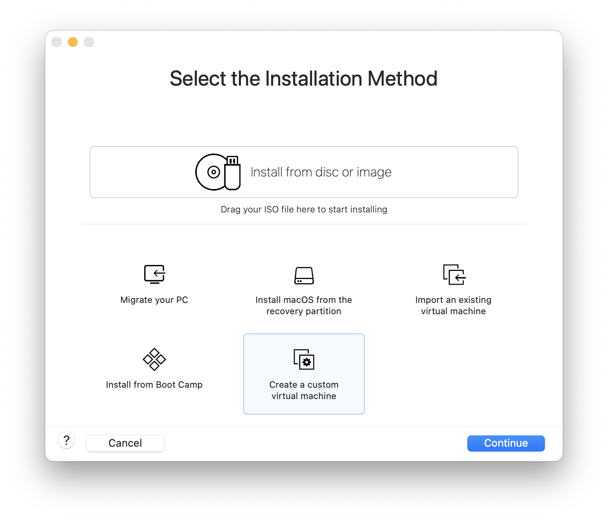
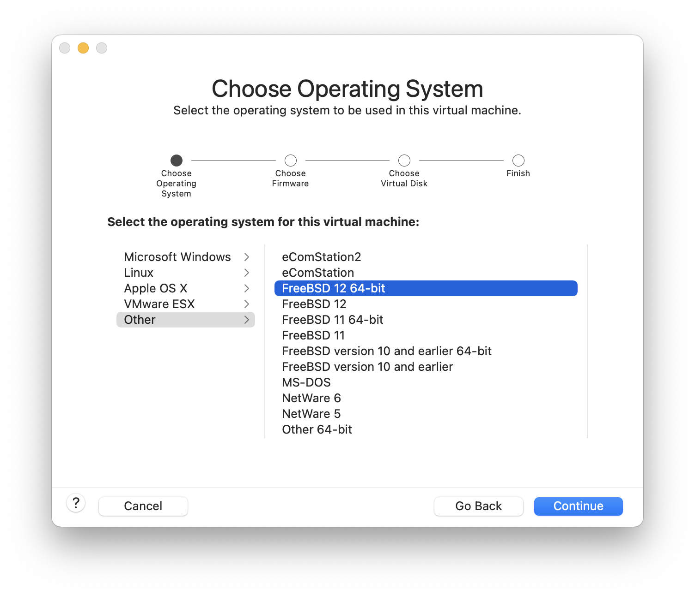
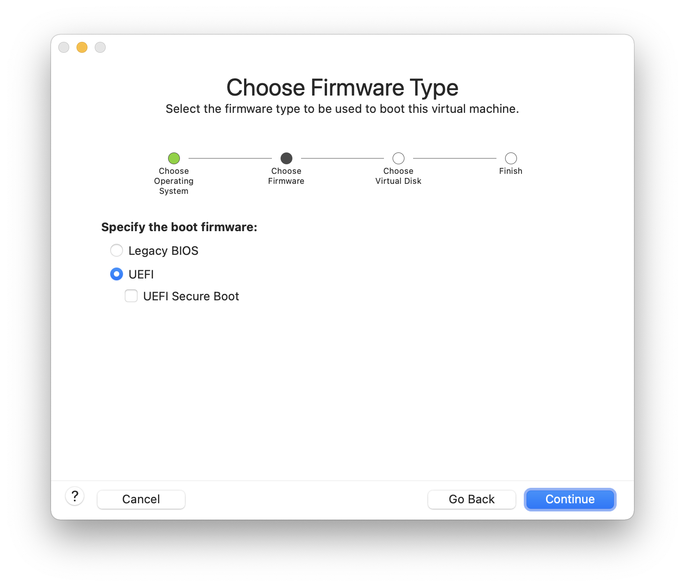
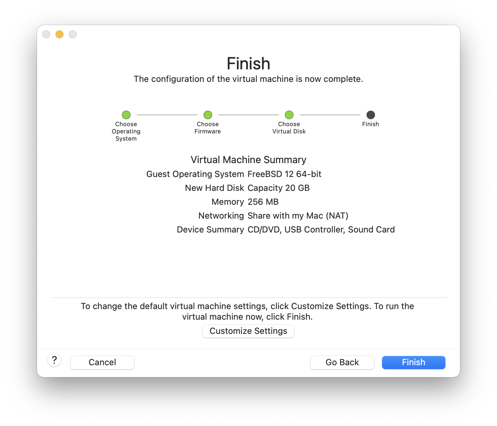
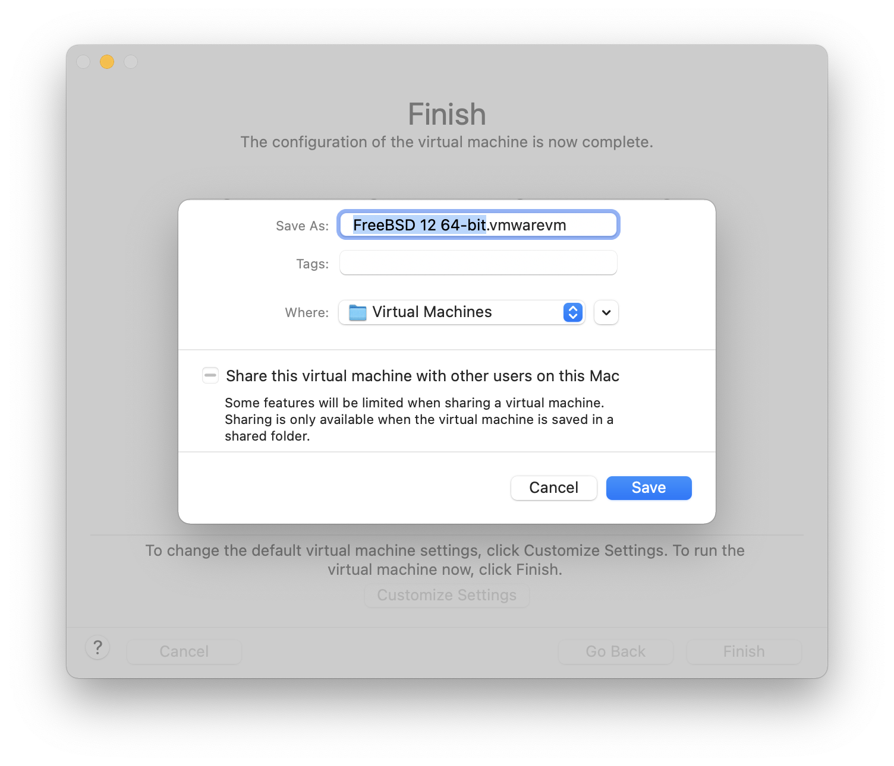
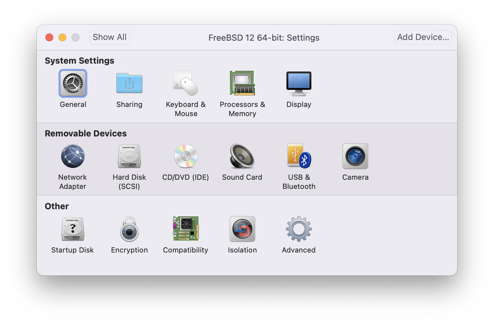
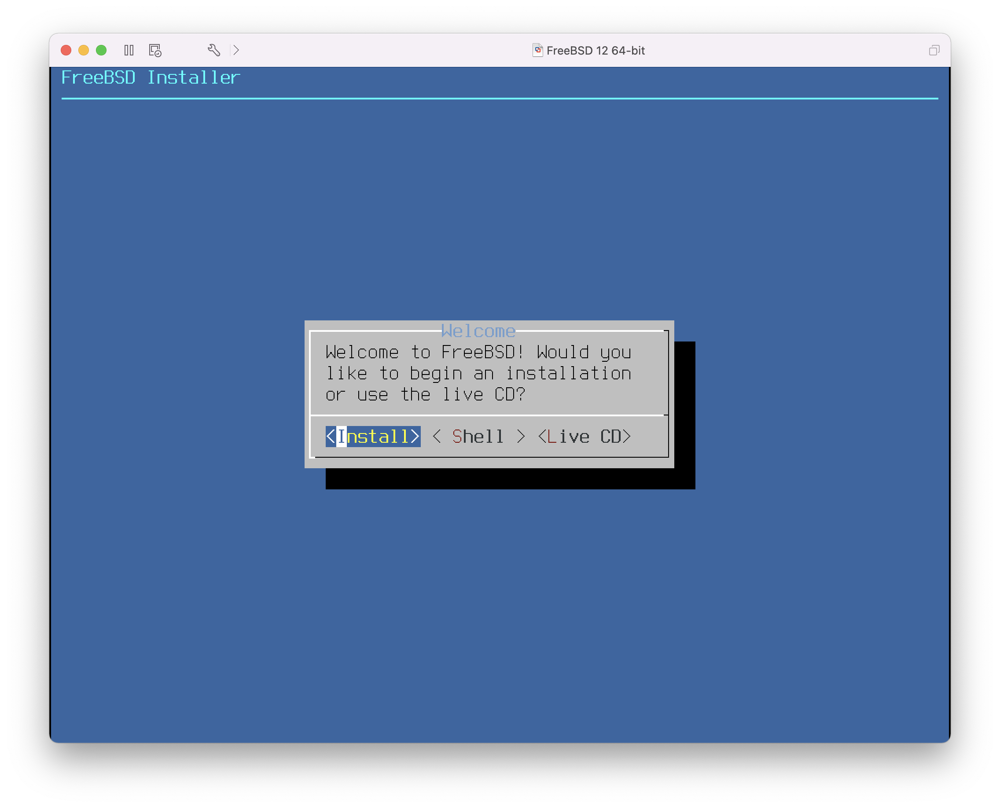
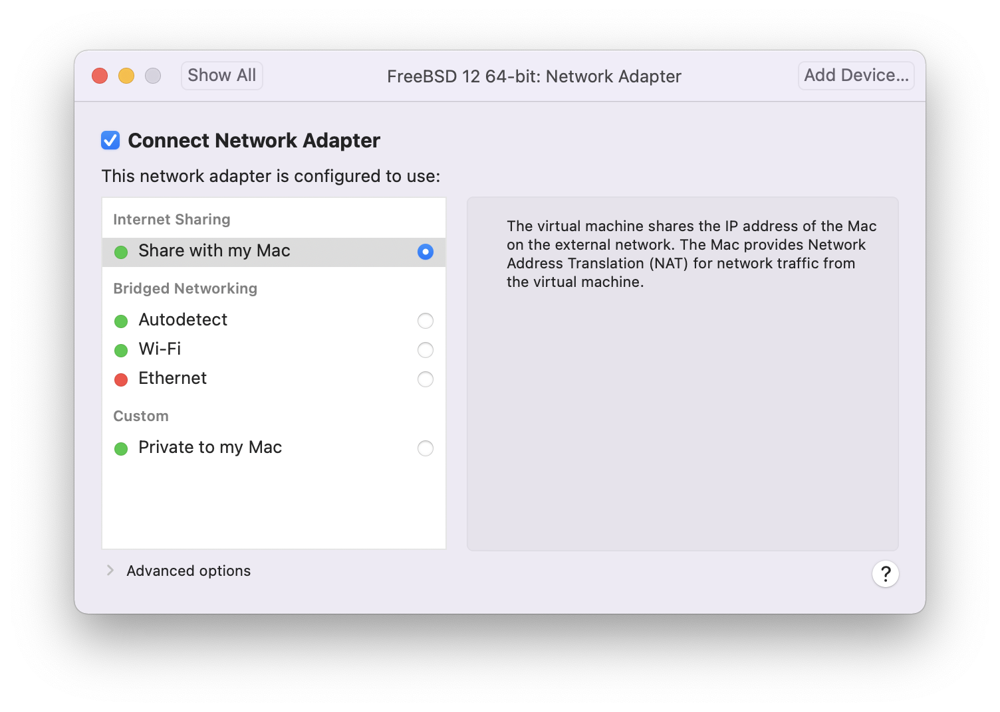

# 22.3.使用 macOS® 上的 VMware Fusion 安装 FreeBSD

VMware Fusion for Mac® 是用于基于 Intel® 的 Apple® Mac® 计算机的商用软件，需要运行 macOS® 10.11 或更高版本。FreeBSD 是得到其完整支持的客户机系统。在 VMware Fusion 被安装在 macOS® 上之后，用户需要配置一个虚拟机并安装所需的客户机操作系统。

## 22.3.1. 在 VMware Fusion 上安装 FreeBSD

第一步是启动 VMware Fusion 并加载虚拟机资源库。点击 `+` → `新建...` 来创建虚拟机：


接下来会弹出新建虚拟机助理，选择`创建自定虚拟机`并点击`继续`：



选择 `Other` 作为 `Operating System`，并选择 `FreeBSD X` 或 `FreeBSD X 64-bit`， 作为 `Version`，当提示时：



选择指定引导固件（建议选择 UEFI）：



选择`新建虚拟磁盘`然后点击继续：


检查配置是否正确，然后点击`完成`：



为虚拟机命名并选择保存的位置：



按 `command + E` 打开虚拟机配置，然后点击 `CD/DVD`：



选择 FreeBSD 的 ISO 镜像文件，或者关联到实体的 CD/DVD：


启动虚拟机：


进行正常的 FreeBSD 安装流程：



在安装完成之后，你可以更改虚拟机配置，例如内存大小和分配给虚拟机的 CPU 核心数量：

> 提示：
>
> 虚拟机的`系统硬件`设置在虚拟机运行期间无法被修改。


在一般情况下，如果不再需要，将 CD/DVD/ISO 从虚拟机断开连接。


最后设置虚拟机连接到网络的方式。若要允许除宿主之外的机器连接到虚拟机，请选择连接到物理网络介面（桥接模式网络连接）。其他情况下，推荐使用`与我的 Mac 共享`（NAT），该模式允许虚拟机连接到互联网，但外部网络无法直接访问虚拟机。



编辑设置之后，启动进入全新安装的 FreeBSD 虚拟机。

## 22.3.2. 在 VMware Fusion 上配置 FreeBSD

在 macOS® 的 VMware Fusion 上成功安装 FreeBSD 之后，可以进行如下几个配置来为虚拟化操作对系统进行优化。

> 1.  设置启动加载器变量 最重要的一步是调整可调节的 `kern.hz` 来减少 FreeBSD 在 VMware Fusion 环境下的 CPU 使用率。这可通过在 **/boot/loader.conf** 中加入如下一行来实现：
>
>     ```
>     kern.hz=100
>     ```
>
>     在没有此项设置的情况下，VMware Fusion 中运行的 FreeBSD 在闲置状态下会占用大约 15% 的 CPU（在一台搭载单颗处理器的 iMac® 上）。进行设置后，占用率可以降低到 5% 左右。
> 2. 创建新的内核配置文件 所有 SCSI，火线和 USB 设备驱动都可以从自定义内核配置文件中移除。VMware Fusion 提供一个虚拟网络适配器并由 `em`(4) 驱动使用，所以除了 `em`(4) 之外的网络驱动都可以从内核中移除。
> 3. 配置网络 最基本的网络配置使用 DHCP 来将虚拟机连接到宿主机 Mac® 所在的同一个局域网中。这可以通过向 **/etc/rc.conf** 中添加 `ifconfig_em0="DHCP"` 来实现。更高级的网络设置请参见高级网络配置（见第 32 章）。
> 4.  安装驱动和 open-vm-tools 若要在 VMware 上顺畅地运行 FreeBSD，你应该安装驱动：
>
>     ```
>     # pkg install xf86-video-vmware xf86-input-vmmouse open-vm-tools
>     ```
