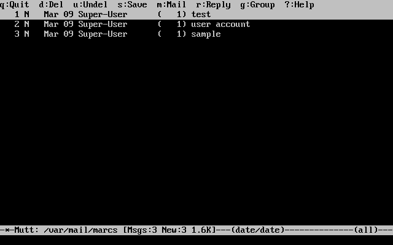
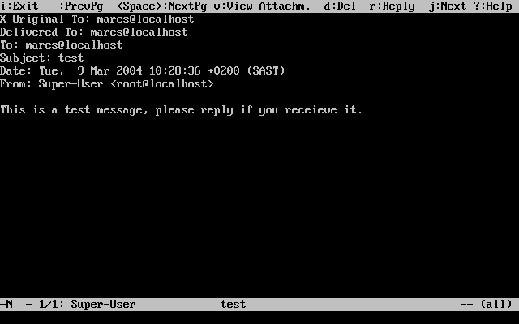
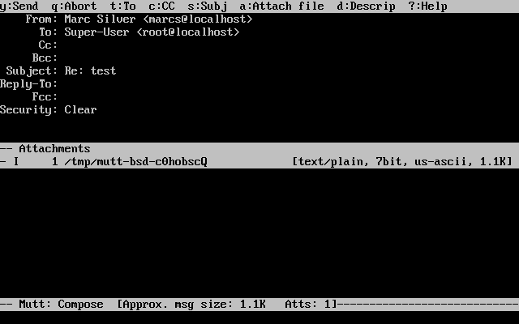
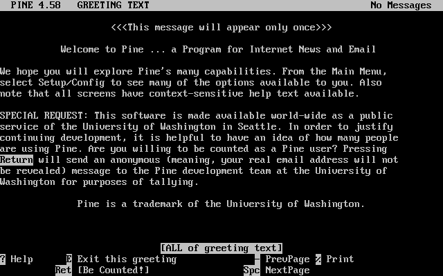
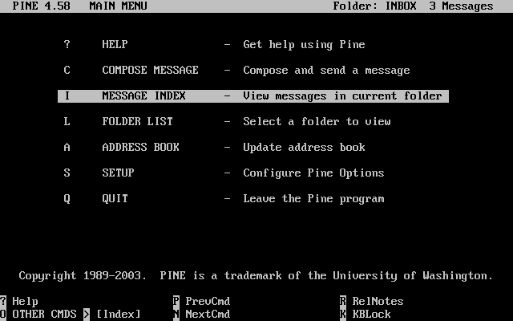
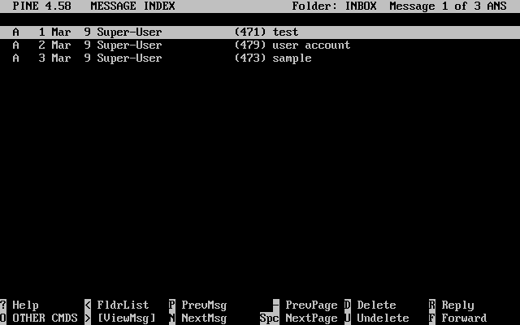
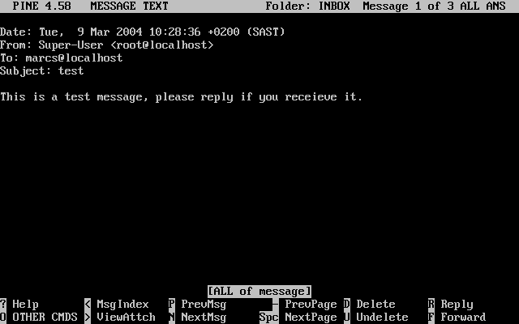
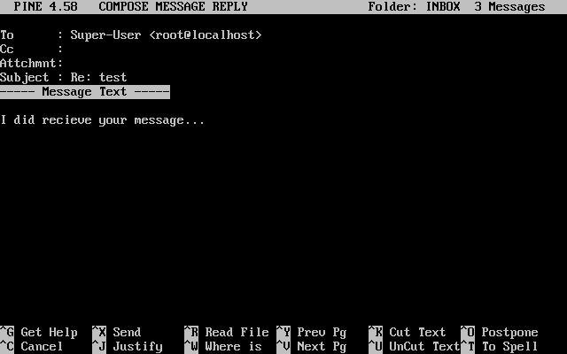

# 29.10.邮件用户代理

邮件用户代理 (MUA) 是一个用于收发邮件的应用程序。更进一步，随着电子邮件的“演化”并愈发复杂，MUA 在和电子邮件相结合方面变得日趋强大； 这为用户提供了更多的功能和灵活性。FreeBSD 包含了对于众多邮件用户代理的支持，其中包括图形化的电子邮件客户端，如 Evolution 或 Balsa，以及基于命令行的客户端，如 mutt 或 alpine 。

## 29.10.1.mail

[mail(1)](https://www.freebsd.org/cgi/man.cgi?query=mail\&sektion=1\&format=html) 是 FreeBSD 中默认的邮件用户代理 (MUA)。它是一个基于控制台的 MUA，提供了所有用于收发文本形式的电子邮件所需的基本功能，它处理附件的能力有限，并且只支持本地的信箱。

虽然 `mail` 没有内建的 POP 或 IMAP 服务器支持，然而这些信箱可以通过类似 `fetchmail` 这样的应用程序，来下载到本地的 `mbox` 文件中。

要收发邮件，只需简单地使用 mail 命令，如下所示：

```
% mail
```

用户保存在 **/var/mail** 中的信箱的内容会被 `mail` 程序自动地读取。如果信箱是空的，程序会退出并给出一个消息表示没有邮件。读完了信箱后，将启动应用程序的界面，并列出邮件。所有的邮件会被自动编号，类似下面的样子：

```
Mail version 8.1 6/6/93.  Type ? for help.
"/var/mail/marcs": 3 messages 3 new
>N  1 root@localhost        Mon Mar  8 14:05  14/510   "test"
 N  2 root@localhost        Mon Mar  8 14:05  14/509   "user account"
 N  3 root@localhost        Mon Mar  8 14:05  14/509   "sample"
```

现在，你通过使用 `mail` 的 `t` 命令，并给出邮件的编号，就可以看到邮件了。在这个例子中，我们将阅读第一封邮件：

```
& t 1
Message 1:
From root@localhost  Mon Mar  8 14:05:52 2004
X-Original-To: marcs@localhost
Delivered-To: marcs@localhost
To: marcs@localhost
Subject: test
Date: Mon,  8 Mar 2004 14:05:52 +0200 (SAST)
From: root@localhost (Charlie Root)

This is a test message, please reply if you receive it.
```

正如在上面的例子中所看到的，`t` 键将显示完整的邮件头。要再次查看邮件的列表，可以使用 `h` 键。

如果需要回复邮件，也可以使用 `mail` 来完成，方法是使用 `R` 或 `r` 这两个 `mail` 键。`R` 键会要求 `mail` 只回复发送邮件的人，而 `r` 不仅回复发送邮件的人，而且也会将回复抄送给原来邮件的其他接收者。如果需要，也可以在这些命令后面指定邮件的编号。做完这些之后，就可以输入回复了，在邮件的最后应该有一个只有一个 `.` 的行，例如：

```
& R 1
To: root@localhost
Subject: Re: test

Thank you, I did get your email.
.
EOT
```

要发出新邮件，可以使用 `m`，后面接收件人的邮件地址。多个收件人之间，应该使用 `,` 隔开。接下来需要输入邮件的主题，然后是正文。同样的，在邮件最后需要一个只有 `.`的空行表示结束。

```
& mail root@localhost
Subject: I mastered mail

Now I can send and receive email using mail ... :)
.
EOT& mail root@localhost
Subject: I mastered mail

Now I can send and receive email using mail ... :)
.
EOT
```

在 `mail` 工具中，可以用 `?` 来显示帮助，而参考 [mail(1)](https://www.freebsd.org/cgi/man.cgi?query=mail\&sektion=1\&format=html) 文档则可以获得更多关于 `mail` 的帮助信息。

> **注意**
>
> [mail(1)](https://www.freebsd.org/cgi/man.cgi?query=mail\&sektion=1\&format=html) 命令在设计时没有考虑到要处理附件，因而在这方面他的功能很弱。新的 MUA 能够更智能地处理附件。但如果你仍然希望使用 `mail` 命令，那么 [converters/mpack](https://cgit.freebsd.org/ports/tree/converters/mpack/pkg-descr) port 则是一个值得考虑的附加工具。

## 29.10.2.mutt

mutt 是一个强大的邮件用户代理，它提供了许多卓越的功能，包括：

> * 能够按线索阅读邮件；
> * 支持使用 PGP 对邮件进行数字签名和加密；
> * 支持 MIME ；
> * 支持 Maildir ；
> * 高度可定制。

关于 mutt 的更多信息，请参考 [http://www.mutt.org](http://www.mutt.org) 。

mutt 可以通过 [mail/mutt](https://cgit.freebsd.org/ports/tree/mail/mutt/pkg-descr) port 来安装，安装之后可以通过下面的命令来启动 mutt：

```
% mutt
```

mutt 会自动读取 **/var/mail** 中的用户信箱，并显示其内容。如果用户信箱中没有邮件，则 mutt 将等待来自用户的命令。下面的例子展示了 mutt 列出邮件的情形：



要阅读邮件，只需用光标键选择它，然后按 `Enter` 键。以下是 mutt 显示邮件的例子：



和 [mail(1)](https://www.freebsd.org/cgi/man.cgi?query=mail\&sektion=1\&format=html) 类似，mutt 允许用户只回复发件人，或者回复所有人。如果只想回复发信人，使用 `r` 快捷键。要向原发件人以及所有的邮件收件人发送一个群组回复，可以用 `g` 快捷键。

> ***
>
> mutt 会使用 [vi(1)](https://www.freebsd.org/cgi/man.cgi?query=vi\&sektion=1\&format=html) 命令作为编辑器，用于创建和回复邮件。每个用户可以通过在自己的主目录下创建或编辑 `.muttrc`，并设置编辑器变量或设置 `EDITOR` 环境变量来进行自定义。关于配置 mutt 的更多信息，请参考 [http://www.mutt.org](http://www.mutt.org) 。

要撰写新邮件，需要首先按 `m` 。在输入了有效的邮件主题之后，mutt 将启动 [vi(1)](https://www.freebsd.org/cgi/man.cgi?query=vi\&sektion=1\&format=html) ，你可以在其中撰写邮件。写好邮件的内容之后，存盘并退出 vi，则 mutt 将继续，并显示一些关于将发出的邮件的摘要信息。要发送邮件，只需按 `y` 。下面给出了摘要信息的一个例子：



mutt 也提供了相当详尽的帮助，在绝大多数菜单中，都可以使用 `?` 键将其呼出。屏幕顶行中也会给出常用的快捷键。

## 29.10.3.alpine

alpine 主要是针对初学者设计的，但也提供了一些高级功能。

> **警告**
>
> 过去，alpine 软件被发现有许多远程漏洞，这些漏洞会允许远程的攻击者在用户的本地系统上，通过发送精心炮制的邮件来执行任意的代码。所有的已知问题都已经被修正了，但 alpine 的代码是以很不安全的风格编写的，并且 FreeBSD 安全官相信仍然有一些尚未被发现的安全漏洞。你应当考虑并承担安装 alpine 可能带来的风险。

最新版本的 alpine 可以通过使用 [mail/alpine](https://cgit.freebsd.org/ports/tree/mail/alpine/pkg-descr) port 来安装。装好之后，alpine 可以通过下面的命令启动：

```
% alpine
```

第一次启动 alpine 时，它会显示出一个欢迎页，并给出简要的介绍，以及 alpine 开发小组要求用户匿名发送一封邮件，以便帮助他们了解有多少用户在使用他们开发的客户程序的请求。要发送这封匿名的邮件，请按 `Enter`，你也可以按 `E` 退出，而不发送匿名邮件。下面是欢迎页的一个例子：



接下来展现给用户的将是主菜单，可以很容易地通过光标键在上面进行选择。这个主菜单提供了用于撰写新邮件、 浏览邮件目录，甚至管理地址簿等等的快捷方式。主菜单下面是完成各种功能的快捷键说明。

由 alpine 打开的默认目录是 **inbox**。要查看邮件索引，应按 `I` ，或选择下面所示的 MESSAGE INDEX 选项：



邮件索引展示了当前目录下的邮件，可以使用光标键翻阅。按 `Enter` 键阅读高亮选定的邮件。



在下面的截屏中，使用 alpine 显示了一封示例邮件。在屏幕底部也显示了快捷键供参考。其中的一个例子是 `r` 键，它告诉 MUA 回复正显示的邮件。



在 alpine 中回复邮件，是通过 pico 编辑器完成的，后者默认情况下会随 alpine 一起安装。而 pico 工具使得浏览邮件变得更加简单，并且要比 [vi(1)](https://www.freebsd.org/cgi/man.cgi?query=vi\&sektion=1\&format=html) 或 [mail(1)](https://www.freebsd.org/cgi/man.cgi?query=vi\&sektion=1\&format=html) 更能容忍误操作。回复写好之后，可以用 `Ctrl` + `X` 来发出它。此前，alpine 程序会要求确认。



alpine 程序可以通过使用主菜单中的 `SETUP` 选项来进行定制。请参考 [http://www.washington.edu/alpine](http://www.washington.edu/alpine) 来了解更多信息。
