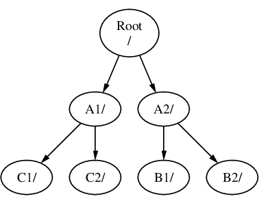
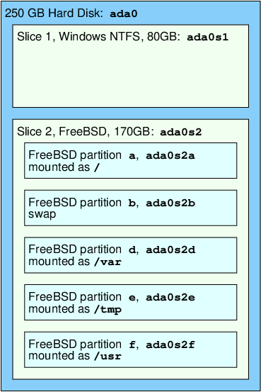

# 3.6.磁盘组织

FreeBSD 用来查找文件的最小组织单位是文件名。文件名是区分大小写的， 这意味着`readme.txt`和`README.TXT`是两个独立的文件。FreeBSD 并不使用文件的扩展名来确定该文件是程序、文档还是其他形式的数据。

文件被存储在目录中。一个目录可能不包含任何文件，也可能包含数百个文件。一个目录也可以包含其他目录，允许目录之间有一个层次结构，以便组织数据。

文件和目录的引用方法是给出文件或目录的名称，后面是一个正斜杠，`/`，后面是任何其他必要的目录名称。例如，如果目录foo包含一个包含文件 `readme.txt`的目录`bar`，那么该文件的全名或路径就是`foo/bar/readme.txt`。请注意，这与 Windows®不同，后者使用`\`来分隔文件和目录名。FreeBSD 在路径中不使用驱动器字母或其他驱动器名称。例如，在 FreeBSD 上，人们不会输入`c:\foo\bar\readme.txt`。

目录和文件存储在一个文件系统中。每个文件系统在最顶层正好包含一个目录，称为该文件系统的根目录。这个根目录可以包含其他目录。一个文件系统被指定为根文件系统或`/`。其他所有的文件系统都挂载在根文件系统下。无论 FreeBSD 系统上有多少个磁盘，每个目录看起来都是同一个磁盘的一部分。

考虑三个文件系统，分别称为 A、B 和 C。每个文件系统有一个根目录，其中包含另外两个目录，称为 A1、A2（同样，B1、B2 和 C1、C2）。

称A为根文件系统。如果用 ls(1)来查看这个目录的内容，它将显示两个子目录，A1 和 A2。该目录树看起来像这样。

一个文件系统必须被挂载到另一个文件系统的目录上。当把文件系统 B 挂载到 A1 目录上时，B 的根目录取代了 A1，B 中的目录也相应地出现。

任何在B1或B2目录下的文件都可以根据需要通过`/A1/B1` 或 `/A1/B2` 的路径到达。任何在`/A1` 中的文件都被暂时隐藏了。如果把 B 从 A 上卸载下来，它们将重新出现。

如果 B 被安装在 A2 上，那么图表会是这样的。

而路径将分别为/A2/B1和/A2/B2。

文件系统可以被安装在彼此的上面。继续上一个例子，C 文件系统可以挂载在 B 文件系统的 B1 目录之上，从而形成这种安排。

或者C可以直接挂载到A文件系统中，在 A1 目录下。

完全可以有一个大的根文件系统，而不需要创建任何其他的。这种方法有一些缺点，也有一个优点。

多种文件系统的好处

- 不同的文件系统可以有不同的挂载选项。例如，根文件系统可以被挂载为只读，使用户不可能无意中删除或编辑一个关键文件。将用户可写的文件系统，如`/home`，与其他文件系统分开，允许它们被挂载为`nosuid`。这个选项可以防止存储在文件系统上的可执行文件的 suid/guid 位生效，从而可能提高安全性。

- FreeBSD 会根据文件系统的使用情况，自动优化文件系统上的文件布局。因此，一个包含许多经常被写入的小文件的文件系统与一个包含较少的大文件的文件系统的优化方式不同。通过拥有一个大的文件系统，这种优化被打破了。

- FreeBSD 的文件系统在断电的情况下是很稳定的。然而，在一个关键点上的断电仍然可能破坏文件系统的结构。通过将数据分割到多个文件系统中，系统更有可能仍能正常工作，从而使其在必要时更容易从备份中恢复。
单一文件系统的好处

- 文件系统的大小是固定的。如果您在安装 FreeBSD 时创建了一个文件系统，并给了它一个特定的大小，您可能会在后来发现您需要把这个分区做得更大。如果不进行备份，以新的大小重新创建文件系统，然后再恢复备份的数据，这是很难做到的。

>**重要提示**
>
>FreeBSD的特色是 growfs(8)命令，这使得它有可能即时增加文件系统的大小，从而消除这一限制。

文件系统被包含在分区中。由于 FreeBSD 的 UNIX® 传统，这与分区一词的通常用法 (例如 MS-DOS® 分区) 的含义不同。每个分区由一个从a到h的字母标识。每个分区只能包含一个文件系统，这意味着文件系统通常由它们在文件系统层次结构中的典型挂载点，或者它们所包含的分区的字母来描述。

FreeBSD还使用磁盘空间作为交换空间来提供虚拟内存。这使你的计算机表现得好像它的内存比实际的要多得多。当 FreeBSD 的内存用完时，它会把一些目前没有被使用的数据移到交换空间，当它需要时再把它移回来（把别的东西移出来）。

有些分区有某些与之相关的惯例。

|  分区 | 约定|
| :-: | :---: |
|  a  | 通常包含根文件系统。 |
|  b  | 通常包含交换空间。 |
|  c  | 通常情况下，它的大小与所包围的区块相同。这允许需要在整个分区上工作的工具，如坏块扫描器，在c分区上工作。通常不会在这个分区上创建文件系统。 |
|  d  | 分区 d 曾经有一个与之相关的特殊含义，虽然现在已经消失了，d可以像任何正常的分区一样工作。 |

FreeBSD 中的磁盘被划分为片状，在 Windows® 中被称为分区，其编号从` 1` 到` 4`。 然后，这些片状被划分为包含文件系统的分区，并使用字母进行标记。

分区编号跟在设备名称后面，以`s`为前缀，从`1`开始。所以`da0s1`是第一个 SCSI 驱动器上的第一片。一个磁盘上只能有四个物理分区，但在适当类型的物理分区内可以有逻辑分区。这些扩展分区的编号从`5`开始，所以`ada0s5`是第一个 SATA 磁盘上的第一个扩展片。这些设备被期望占据一个分区的文件系统所使用。

片区、"危险专用 "物理驱动器和其他驱动器包含分区，这些分区用从`a`到`h`的字母表示。这个字母被附加到设备名称上，所以`da0a`是第一个`da`驱动器上的`a`分区，它是 "危险专用"。"ada1s3e "是第二个 SATA 磁盘驱动器第三片中的第五个分区。

最后，系统中的每个磁盘都被识别。磁盘名称的开头是一个表示磁盘类型的代码，然后是一个数字，表示它是哪一个磁盘。与切片不同，磁盘的编号从0开始，常见的代码在磁盘设备名称中列出。

当提及一个分区时，应包括磁盘名称、s、分区编号，然后是分区字母。示例显示在磁盘、片断和分区名称示例中。

磁盘的概念模型显示了一个磁盘布局的概念模型。

在安装 FreeBSD 时，要配置磁盘片，在分内创建用于 FreeBSD 的分区，在每个分区创建一个文件系统或交换空间，并决定每个文件系统的挂载位置。

表3. 磁盘设备名称

|            驱动器类型           |  驱动器设备名称    |
| :---: | :---: |
|        SATA 和 IDE 硬盘驱动器       |      ada    |
|      SCSI 硬盘驱动器和 USB 存储设备     |    da               |
|           NVMe 存储           |   nvd or nda    |
| SATA and IDE CD-ROM drives | cd                |
|        SCSICD-ROM 驱动器       |       cd |
|            软盘驱动器           |     fd    |
|           SCSI 磁带机          |            sa     |
|           RAID 驱动器          | 例如，Adaptec® AdvancedRAID的aacd，Mylex®的mlxd和mlyd，AMI MegaRAID®的amrd，Compaq Smart RAID的idad，3ware® RAID的twed。 |

表4. 磁盘、片区和分区名称示例

|    命名   | 意义   |
| :-----: | :---: |
| ada0s1a |第一块 SATA 磁盘（ada0）上的第一个分区（a）。     |
|  da1s2e | 第二个 SCSI 磁盘(da1)上的第二个片区(s2)的第五个分区(e)。 |

例12. 磁盘的概念模型

这张图显示了 FreeBSD 对连接到系统的第一个 SATA 磁盘的看法。假设该磁盘的大小为 250 GB，包含一个 80 GB 的分区和一个 170 GB 的分区（MS-DOS® 分区）。第一分区包含一个 Windows® NTFS文件系统`C`：，第二分区包含一个 FreeBSD 安装。这个 FreeBSD 安装实例有四个数据分区和一个交换分区。

这四个分区分别存放一个文件系统。分区`a`用于`/`文件系统，`d`用于`/var/`，`e`用于`/tmp/`，`f`用于`/usr/`。分区字母`c`指的是整个片区，所以不用于普通分区。

